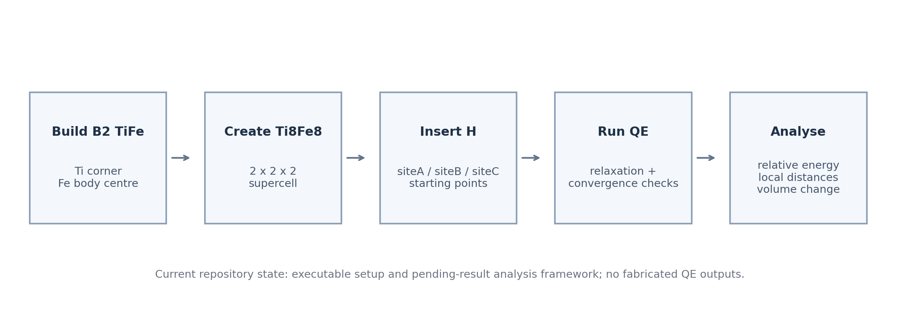
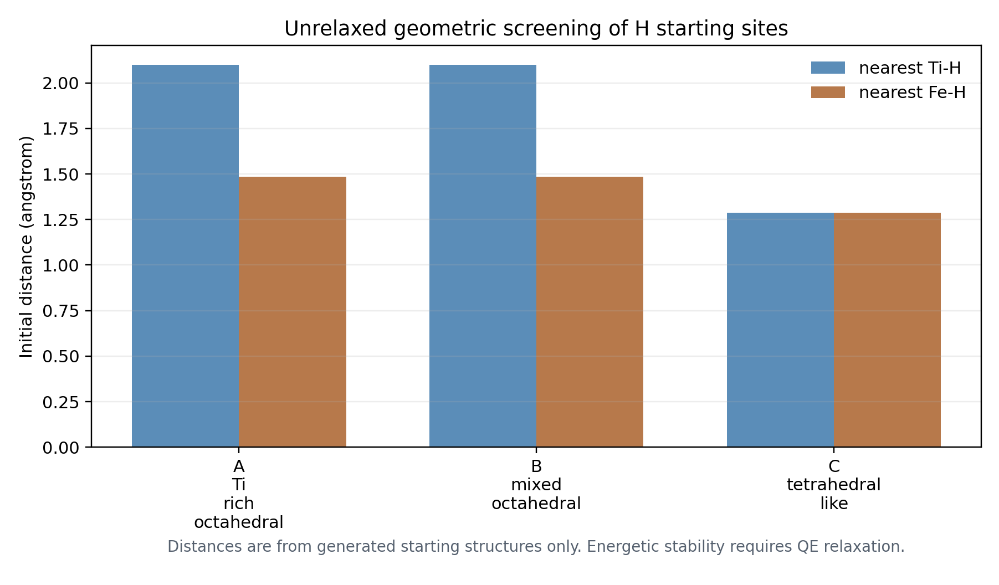

# TiFe Hydrogen DFT Exploration

Exploratory computational materials project on hydrogen incorporation in B2-TiFe intermetallics.

The project builds TiFe crystal structures, prepares Quantum ESPRESSO input files, creates candidate hydrogen interstitial configurations, and provides Python scripts for parsing and analysing future DFT outputs.

It is intentionally framed as an exploratory university research-support workflow, not a full DFT publication or QM/MM study.

## What This Project Shows

- B2-TiFe primitive cell and `2 x 2 x 2` Ti8Fe8 supercell generation.
- Three candidate H interstitial starting sites.
- Quantum ESPRESSO templates for relaxation, convergence checks, H2 reference, and optional DOS.
- Python analysis scripts for energy comparison, insertion energy, local metal-H distances, and volume change.
- Result tables that clearly remain marked `Calculation pending` until real QE outputs are added.



## Current Showcase

The current repository demonstrates the setup and geometry-screening stage. It does not claim completed DFT energies.



Short showcase page:

[docs/showcase.md](docs/showcase.md)

## Quick Start

```powershell
python -m pip install -r requirements.txt
python src/run_workflow_setup.py
```

Example QE execution after installing Quantum ESPRESSO and pseudopotentials:

```bash
pw.x < qe_inputs/pristine/TiFe_vc_relax.in > qe_outputs/TiFe_vc_relax.out
```

## Project Layout

```text
structures/   generated CIF and XYZ files
qe_inputs/    Quantum ESPRESSO input templates
src/          Python generation and analysis scripts
results/      CSV summaries
figures/      showcase and analysis figures
docs/         methodology and theory notes
```

## Notes

No fabricated simulation outputs are included. Energetic conclusions require running the Quantum ESPRESSO calculations and parsing the resulting output files.

More detail:

- [Methodology](docs/methodology.md)
- [Theory notes](docs/theory_notes.md)
- [Interpretation guidance](docs/interpretation.md)
